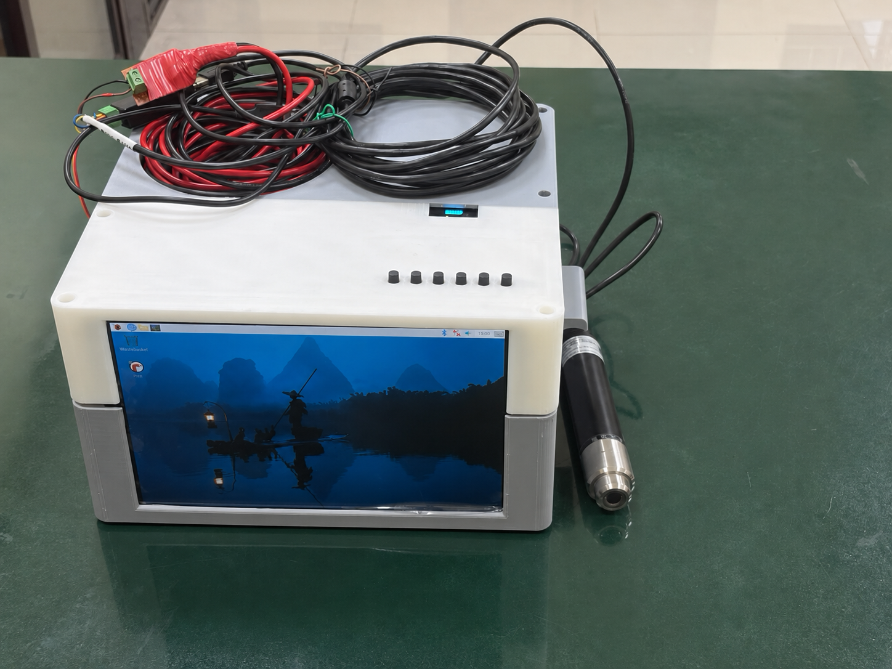

# AURA Membership Function for Neuro-Fuzzy Process Control Automation and Nonlinear Dynamic Modeling

**AURA (Asymmetric Unified Relativistic Attractor)** is an asymmetric, center-anchored fuzzy membership function and a reusable neuro-fuzzy modeling pipeline for regression, time-series prediction, system identification, and process-control research.

This repository contains:

- the complete single-file AURA training and inference program;
- four ready-to-inspect trained model artifacts;
- the datasets used for four validation domains;
- the AURA neural architecture;
- comparative accuracy, trajectory, parity, residual, rule-usage, and learned-membership plots;
- photographs of the dissolved-oxygen prototype and field-testing setup; and
- source documents for the cascaded-tanks and coupled-electric-drives benchmarks.

The repository consolidates the model definition, training workflow, domain datasets, evaluation evidence, exported models, and implementation photographs in a single technical reference that can be followed without prior knowledge of fuzzy logic.

> **Important scientific note**
>
> The repository presents two complementary result sets. The plots and annotated metrics document controlled validation experiments that compare AURA with Gaussian and generalized-bell membership functions under matched conditions. The <code>.pkl</code> artifacts contain the final fine-tuned AURA models together with their preprocessing, stored schemas, and validation-selected prediction components. Differences in rule counts, data splits, test sizes, and metric values reflect these distinct experimental objectives. Together, the comparison figures establish relative performance and the exported artifacts provide finalized implementations for direct inference on schema-compatible data.

---

## Table of contents

1. [Project overview](#project-overview)
2. [What problem does AURA solve?](#what-problem-does-aura-solve)
3. [AURA in very simple language](#aura-in-very-simple-language)
4. [How the unified AURA pipeline works](#how-the-unified-aura-pipeline-works)
5. [Neural architecture](#neural-architecture)
6. [Repository contents](#repository-contents)
7. [Installation](#installation)
8. [Quick start](#quick-start)
9. [Using the trained models](#using-the-trained-models)
10. [Trained-model schemas and metrics](#trained-model-schemas-and-metrics)
11. [Training AURA on a new dataset](#training-aura-on-a-new-dataset)
12. [Domain-specific retraining examples](#domain-specific-retraining-examples)
13. [Datasets](#datasets)
14. [Research results and inline plots](#research-results-and-inline-plots)
15. [Prototype and field testing](#prototype-and-field-testing)
16. [Evaluation metrics](#evaluation-metrics)
17. [Reproducibility and fair evaluation](#reproducibility-and-fair-evaluation)
18. [Troubleshooting](#troubleshooting)
19. [Citation](#citation)
20. [Licensing and permitted reuse](#licensing-and-permitted-reuse)
21. [Contribution](#Contribution)

---

## Project overview

Many real processes are nonlinear: the same input can produce different behavior depending on the operating region, direction of movement, history, saturation, or disturbance level. Standard symmetric fuzzy membership functions, such as Gaussian and generalized-bell functions, can be effective, but they use the same basic shape on both sides of their center unless additional mechanisms are added.

AURA was developed to give a fuzzy premise function more controlled freedom:

- the membership value is exactly anchored at its center;
- the left and right sides can have different effective widths;
- the two tails can decay with different orders;
- bounded skew terms can change shoulder and tail geometry;
- mathematical constraints keep the learned shape finite, positive, and numerically stable; and
- the function can be optimized inside an adaptive neuro-fuzzy inference system.

The repository validates AURA in four nonlinear process domains:

| Domain | Main task | Data type | Main output |
|:---:|:---:|:---:|:---:|
| Dissolved oxygen (DO) control | One-step controller-output prediction and ANFIS-PID analysis | Large multi-scenario time series | DAC command |
| pH neutralization | One-step nonlinear process prediction | Simulated stirred-tank trajectory | Future pH |
| Cascaded tanks with overflow | Nonlinear system identification under overflow and saturation | Benchmark estimation/test data | Lower-tank level |
| Coupled electric drives | Multi-output nonlinear dynamic prediction | Short-record benchmark data | Outputs <code>z11</code> and <code>z12</code> |

The same repository therefore demonstrates:

- single-output and multi-output regression;
- static and autoregressive time-series preparation;
- controller-state feature construction;
- chronological and independent external testing;
- cross-seed and cross-membership comparisons;
- physical prototype implementation; and
- reusable training and prediction from a command-line interface.

---

## What problem does AURA solve?

A fuzzy model divides an input space into overlapping regions. Each region has a local rule such as:

> If the error is moderately negative and the error rate is close to zero, then apply this local output relationship.

A membership function decides how strongly a sample belongs to each region. If the membership geometry is too rigid, a fuzzy model may need more rules or may struggle around asymmetric transitions, saturation boundaries, nonlinear shoulders, or direction-dependent dynamics.

AURA addresses this premise-geometry problem by supplying a trainable asymmetric membership layer within an ANFIS or PID-integrated system. The surrounding model normalizes the resulting rule strengths and combines local Takagi-Sugeno outputs or controller branches.

In <code>AURA.py</code>, the complete predictor is:

1. data preparation and leakage-aware window construction;
2. robust numerical/categorical encoding;
3. AURA membership evaluation;
4. normalized fuzzy-rule firing;
5. first-order Takagi-Sugeno local consequents;
6. validation-selected AURA parameter tuning;
7. optional validation-selected residual refinement;
8. held-out testing and diagnostic plotting; and
9. model serialization with a reload-consistency check.

---

## AURA in very simple language

Imagine placing several flexible hills over an input axis:

- the top of each hill marks the center of a fuzzy region;
- the hill height shows how strongly an input belongs to that region;
- the left and right sides can adopt different shapes;
- one side can be narrow and fast-decaying while the other is wider or heavier-tailed; and
- safety limits prevent the hill from becoming invalid during learning.

For a sample, AURA calculates one membership value for every input dimension and rule. Memberships belonging to the same rule are multiplied. The resulting firing strengths are normalized so that all rule weights sum to one. Every rule produces a local linear prediction, and the final AURA prediction is the weighted sum of those local predictions.

This gives a readable mixture-of-local-models interpretation:

- **membership functions** decide where a rule is relevant;
- **rule firing strengths** decide how much that rule contributes; and
- **Takagi-Sugeno consequents** decide what that rule predicts.

---

## How the unified AURA pipeline works

### 1. Data loading

<code>AURA.py</code> can read:

- CSV and plain-text tables;
- TSV;
- Excel <code>.xlsx</code> and <code>.xls</code>;
- Parquet;
- JSON; and
- JSON Lines.

A directory can be supplied instead of one file. Supported files are found recursively. Each file is assigned a source-file identifier and is treated as a separate sequence.

MATLAB <code>.mat</code> files are included for benchmark compatibility. The supplied CSV equivalents provide direct input to <code>AURA.py</code>, and MAT data can also be converted to any supported table format.

### 2. Leakage-aware supervised examples

The script supports:

- static row-wise regression;
- lagged inputs;
- one-step or multi-step forecast horizons;
- first and second differences;
- three-sample rolling means; and
- PID-style error, error-rate, and error-integral features.

Lag history, differences, rolling means, and future targets are calculated separately within every source file. They never cross from the end of one experiment into the beginning of another.

For a static model with horizon zero, the target is forbidden as a same-row feature. For autoregression, the target may be an input only when a positive future horizon is used.

### 3. Robust input encoding

The encoder is fitted on training rows only:

- mostly numeric columns are median-imputed and robustly standardized;
- scale is based on interquartile spread with a standard-deviation safeguard;
- extreme standardized values are clipped;
- categorical columns are one-hot encoded;
- the most frequent categories are retained; and
- unseen categories enter an <code>__OTHER__</code> column.

Targets are standardized using the training-target mean and standard deviation.

### 4. AURA rule initialization

K-means or mini-batch K-means initializes rule centers. Local robust spreads initialize the widths. Several feasible starting-shape presets are available:

- <code>default</code>;
- <code>lowtail</code>;
- <code>phtail</code>; and
- <code>wide</code>.

### 5. Validation-based configuration search

The script screens combinations of:

- initialization seeds;
- rule counts;
- shape presets; and
- ridge penalties for the Takagi-Sugeno consequents.

Candidate ranking uses validation RMSE, not the held-out test set.

### 6. Hybrid learning

The best screened candidates can be refined with PyTorch:

- AdamW updates premise and consequent parameters;
- the loss combines mean squared error, smooth L1 loss, and a small feasibility/anchoring penalty;
- gradient norms are clipped;
- the learning rate is reduced when validation improvement slows;
- ridge refitting periodically updates the local consequents; and
- early stopping retains the best validation state.

### 7. Optional residual refinement

After the AURA predictor is frozen, the program may validate an internal residual expert. Available candidates include:

- no refiner;
- Extra Trees with several leaf-size settings;
- Random Forest; and
- histogram gradient boosting.

The refiner receives encoded inputs, the base AURA prediction, normalized rule weights, rule-weight entropy, and maximum firing strength. A bounded validation-fitted multiplier controls its contribution. The selected refiner is refitted on training plus validation rows, while the final test rows remain untouched.

This stage belongs to the **final unified training pipeline** and produces a validation-selected exported model. The AURA-versus-Gaussian-versus-bell figures use matched experimental settings for membership-function comparison, whereas the exported models retain the validated configuration selected for each domain.

### 8. Held-out evaluation and export

The final model is evaluated once on the held-out or external test set. The program:

- prints a broad metric report;
- generates six generic diagnostic plots unless disabled;
- stores the complete preprocessing and model pipeline in one pickle;
- reloads the pickle; and
- verifies that reloaded predictions match the in-memory predictions.

---

## Neural architecture

The following repository figure summarizes AURA fuzzification, rule inference, log-domain normalization, hybrid consequents, bounded outputs, the dissolved-oxygen ANFIS-PID path, and the cross-domain validation instantiations.

  

<em>Figure: AURA membership-function-based ANFIS-PID neural architecture and cross-domain validation layouts.</em>

The upper part of the image shows the detailed dissolved-oxygen research architecture, including:

- PID-state inputs;
- 7, 5, and 3 membership functions across the three controller inputs;
- 105 rule combinations;
- log-domain normalization;
- rule-wise data and PID branches;
- adaptive mixing;
- bounded DAC aggregation; and
- an auxiliary RPM head.

The lower part shows how the AURA premise is reused for dissolved oxygen, coupled drives, cascaded tanks, and pH neutralization.

> The architecture figure explains the detailed research and comparison systems. Each exported model retains the rule count, input schema, preprocessing, and validation-selected components of its final domain configuration. The stored configurations are listed later in this README.

---

## Repository contents

~~~text
|-- AURA.py
|-- AURA Neural Architecture.png
|-- cto.pkl
|-- ced.pkl
|-- do.pkl
|-- pH.pkl
|-- Prototype.png
|-- Field Testing.png
|-- Cascaded Tanks with Overflow Datasets/
    |-- dataBenchmark.csv
    |-- dataBenchmark.mat
    |-- TanksBenchmark.pdf
|-- Cascaded Tanks with Overflow AURA Model Analysis/
    |-- 01-04: comparison, operating-region, trajectory, and parity plots
|-- Coupled Eletric Drives Datasets/
    |-- DATAPRBS.csv / DATAPRBS.MAT
    |-- DATAUNIF.csv / DATAUNIF.MAT
    |-- Coupled Electric Drives Data Set and Reference Models.pdf
|-- Coupled Electric Drives AURA Model Analysis/
    |-- 05-08: comparison, trajectory, parity, and rule-usage plots
|-- Dissolved Oxygen Datasets/
    |-- Set 6/
    |-- Set 7/
        |-- Clean, Drift, Impulse, PLI, Quantization, Ripple, and WGN scenarios
|-- Dissolved Oxygen AURA Model Analysis/
    |-- 09-12: fair comparison, fidelity, controller, and learned-MF plots
|-- pH Datasets/
    |-- pHdata.xlsx
    |-- pH description.txt
|-- pH Neutralization AURA Model Analysis/
    |-- 13-16: comparison, trajectory, parity, and residual plots
~~~

### Main files

| File | Purpose |
|:---:|:---:|
| <code>AURA.py</code> | AURA model full retraining pipe-line code to train model on other datasets or domains as per user's requirements  |
| <code>cto.pkl</code> | Trained Cascaded Tanks with Overflow model |
| <code>ced.pkl</code> | Trained Coupled Electric Drives model |
| <code>do.pkl</code> | Trained Dissolved Oxygen model |
| <code>pH.pkl</code> | Trained pH Neutralization model |
| <code>AURA Neural Architecture.png</code> | Full architecture and cross-domain overview |
| <code>Prototype.png</code> | Implemented sensing/control prototype |
| <code>Field Testing.png</code> | Pond-side aeration field test |

---

## Installation

### Requirements

- Python 3.10 or newer is recommended.
- A CUDA-capable GPU is optional. CPU training is supported.
- scikit-learn 1.8.0 matches the included trained model artifacts.

### Clone the repository

~~~bash
git clone https://github.com/Agnibha-31/AURA-Membership-Function-Neuro-Fuzzy-Process-Control-Automation.git
cd AURA-Membership-Function-Neuro-Fuzzy-Process-Control-Automation
~~~

### Create a virtual environment

Linux or macOS:

~~~bash
python -m venv .venv
source .venv/bin/activate
~~~

Windows PowerShell:

~~~powershell
python -m venv .venv
.venv\Scripts\Activate.ps1
~~~

### Install the dependencies

~~~bash
python -m pip install --upgrade pip
python -m pip install numpy pandas scipy scikit-learn==1.8.0 torch matplotlib openpyxl pyarrow
~~~

Why these packages are used:

| Package | Purpose |
|:---:|:---:|
| NumPy | Numerical arrays and AURA inference |
| pandas | Table loading, preparation, and prediction output |
| SciPy | Useful for working with the included MAT benchmark files |
| scikit-learn 1.8.0 | Clustering, ridge consequents, refiners, and metrics |
| PyTorch | Gradient-based AURA tuning |
| Matplotlib | Diagnostic plot generation |
| openpyxl | Reading the included pH Excel workbook |
| PyArrow | Optional Parquet support |

Check the command-line interface:

~~~bash
python AURA.py --version
python AURA.py --help
python AURA.py train --help
~~~

---

## Quick start

### Inspect a trained model

~~~bash
python AURA.py inspect --model do.pkl
~~~

The command prints the stored schema, rule count, selected configuration, refinement method, evaluation protocol when available, and stored test metrics.

### Predict with a trained model

~~~bash
python AURA.py predict --model do.pkl --data new_do_sequence.csv --output do_predictions.csv
~~~

The output contains:

- <code>source_file</code>;
- <code>source_row</code>; and
- one <code>prediction_*</code> column for each model target.

### Train a small static regression model

~~~bash
python AURA.py train --data data.csv --target y --features x1,x2,x3 --split random --model-out aura_model.pkl
~~~

Use a random split only when rows are genuinely independent. If order represents time, batches, patients, locations, or related experiments, use a chronological split or separate validation and test files.

### Train a one-step forecasting model

~~~bash
python AURA.py train --data train_runs --target y --features u,y --lags 1:20 --horizon 1 --dynamic-features --external-data unseen_test_runs --model-out aura_forecast.pkl
~~~

Every file in <code>train_runs</code> or <code>unseen_test_runs</code> is treated as a separate sequence.

---

## Using the trained models

### Model compatibility

Model loading requires <code>AURA.py</code> in the working directory or on <code>PYTHONPATH</code> so the serialized AURA model class can be resolved.

The model artifacts were created by AURA pipeline version 1.0.0, while the current script reports version 1.1.0. The script preserves a backward-compatible <code>aura_unified</code> module alias for these earlier pickles.

### Required input columns

| Model | Prediction task | Columns required in a new input table | History requirement |
|:---:|:---:|:---:|:---:|
| <code>cto.pkl</code> | Predict the next <code>yEst</code> tank level | <code>uEst</code>, <code>yEst</code> | Current values plus lags 1-20 |
| <code>ced.pkl</code> | Predict next <code>z11</code> and <code>z12</code> | <code>u11</code>, <code>u12</code>, <code>z11</code>, <code>z12</code> | Current values plus lags 1-5 |
| <code>do.pkl</code> | Predict the next DAC command | <code>dac</code>, <code>do</code> | Current rows; PID and dynamic features are generated internally |
| <code>pH.pkl</code> | Predict the next pH output | <code>input u1</code>, <code>input u2</code>, <code>output y</code> | Current values plus lags 1-14 and dynamic features |

Column names are case-sensitive. Paths and column lists containing spaces must be quoted.

Examples:

~~~bash
python AURA.py predict --model cto.pkl --data new_tank_sequence.csv --output tank_predictions.csv
python AURA.py predict --model ced.pkl --data new_drive_sequence.csv --output drive_predictions.csv
python AURA.py predict --model do.pkl --data new_do_sequence.csv --output do_predictions.csv
python AURA.py predict --model pH.pkl --data new_ph_sequence.xlsx --output ph_predictions.csv
~~~

Ordinary static prediction operates without a target column. An autoregressive model uses the historical output column because past measured outputs form part of its input.

---

## Trained-model schemas and metrics

The following values come directly from metadata stored in the final fine-tuned model artifacts and describe their retained test evaluations. The research plots later in this README summarize the matched AURA-versus-Gaussian-versus-bell validation experiments. The two metric sets correspond to their respective final-model and comparative-evaluation configurations.

| Artifact | Test samples | AURA rules | Encoded inputs | Refiner | Test RMSE | Test MAE | Test R2 |
|:---:|:---:|:---:|:---:|:---:|:---:|:---:|:---:|
| <code>cto.pkl</code> | 1,003 | 4 | 42 | Histogram gradient boosting | 0.049254 | 0.030530 | 0.999457 |
| <code>ced.pkl</code> | 75 | 4 | 24 | Random Forest | 0.031563 macro | 0.023267 macro | 0.994172 macro |
| <code>do.pkl</code> | 139,986 | 4 | 20 | Histogram gradient boosting | 0.072587 V | 0.023473 V | 0.995367 |
| <code>pH.pkl</code> | 299 | 4 | 54 | Histogram gradient boosting | 0.165581 pH | 0.067449 pH | 0.995545 |

For the two CED outputs:

| Output | RMSE | MAE | R2 |
|:---:|:---:|:---:|:---:|
| <code>z11</code> | 0.036039 | 0.026221 | 0.990614 |
| <code>z12</code> | 0.027086 | 0.020314 | 0.997730 |

### Trained-model configuration summary

| Artifact | Seed | Preset | Ridge alpha | Requested epochs | Target bounds |
|:---:|:---:|:---:|:---:|:---:|:---:|
| <code>cto.pkl</code> | 21 | <code>default</code> | 0.001 | 120 | 0 to 10 |
| <code>ced.pkl</code> | 42 | <code>wide</code> | 0.00001 | 80 | -0.1 to 4.0 |
| <code>do.pkl</code> | 42 | <code>default</code> | 0.001 | 12 | 1.324 to 3.885 V |
| <code>pH.pkl</code> | 42 | <code>phtail</code> | 0.1 | 70 | 0 to 14 pH |

---

## Training AURA on a new dataset

### Step 1: Define one prediction question

Examples:

- predict product quality from temperature, pressure, and flow;
- predict the next pH from current and past flows and pH;
- estimate a controller command from error-state variables; or
- predict two coupled process outputs simultaneously.

### Step 2: Choose valid features

Only use variables available at real prediction time.

Avoid:

- a target copied into another column;
- future information;
- IDs that directly encode the answer;
- data-normalization values calculated using the test set; and
- same-row target input when the horizon is zero.

For final scientific experiments, explicitly name the features instead of relying on <code>--features auto</code>.

### Step 3: Select the evaluation design

Preferred order of strength:

1. independent external test trajectories;
2. separate validation and external test files;
3. chronological train/validation/test split; and
4. random split only for truly independent rows.

### Step 4: Run training

Static example:

~~~bash
python AURA.py train --data experiment.csv --target quality --features temperature,pressure,flow --split random --model-out quality_aura.pkl
~~~

Chronological example:

~~~bash
python AURA.py train --data process.csv --target output --features input1,input2 --split chronological --model-out process_aura.pkl
~~~

Independent external-test example:

~~~bash
python AURA.py train --data training_runs --target y --features u,y --lags 1:12 --horizon 1 --validation-data validation_runs --external-data test_runs --model-out final_aura.pkl
~~~

If validation and test files use different column names, map them positionally:

~~~bash
python AURA.py train --data train.csv --target y_train --features u_train,y_train --lags 1:10 --horizon 1 --validation-data validation.csv --validation-target y_validation --validation-features u_validation,y_validation --external-data test.csv --external-target y_test --external-features u_test,y_test --model-out mapped_aura.pkl
~~~

### Important training options

| Option | Purpose |
|:---:|:---:|
| <code>--data</code> | One or more input files or directories |
| <code>--data-regex</code> | Restrict recursively discovered input files |
| <code>--target</code> | One or more comma-separated target columns |
| <code>--features</code> | Explicit feature columns or <code>auto</code> |
| <code>--lags</code> | Lag list or range, such as <code>1:20</code> |
| <code>--horizon</code> | Future prediction distance |
| <code>--dynamic-features</code> | Add differences and rolling means |
| <code>--validation-data</code> | Separate configuration-selection data |
| <code>--external-data</code> | Independent final test data |
| <code>--split</code> | <code>chronological</code> or <code>random</code> |
| <code>--rules</code> | Candidate fuzzy-rule counts |
| <code>--presets</code> | Candidate AURA shape initializations |
| <code>--seeds</code> | Candidate initialization seeds |
| <code>--ridge-alphas</code> | Consequent ridge penalties |
| <code>--epochs</code> | Maximum gradient-tuning epochs |
| <code>--device</code> | <code>auto</code>, <code>cpu</code>, or <code>cuda</code> |
| <code>--refiner-candidates</code> | Residual experts considered on validation data |
| <code>--target-bounds</code> | One lower/upper clipping interval applied to all outputs |
| <code>--pid-source</code> | Measured variable used to build PID-error features |
| <code>--pid-setpoint</code> | Reference value for PID-error calculation |
| <code>--plots-dir</code> | Custom diagnostic-plot directory |
| <code>--no-plots</code> | Disable plots for headless automation |

Run <code>python AURA.py train --help</code> for every option and default.

---

## Domain-specific retraining examples

The following commands reconstruct the schemas and main stored configurations of the included models. Exact floating-point values can vary with the operating system, processor or GPU, library builds, and pipeline-version differences between 1.0.0 and 1.1.0.

### Cascaded tanks with overflow

The CSV stores estimation columns (<code>uEst</code>, <code>yEst</code>) and separate validation/test columns (<code>uVal</code>, <code>yVal</code>) in the same physical file.

~~~bash
python AURA.py train \
  --data "Cascaded Tanks with Overflow Datasets/dataBenchmark.csv" \
  --target yEst \
  --features uEst,yEst \
  --lags 1:20 \
  --horizon 1 \
  --external-data "Cascaded Tanks with Overflow Datasets/dataBenchmark.csv" \
  --external-target yVal \
  --external-features uVal,yVal \
  --rules 4 \
  --presets default \
  --seeds 21 \
  --ridge-alphas 0.001 \
  --epochs 120 \
  --refiner-candidates hist_gradient \
  --target-bounds 0,10 \
  --model-out cto_retrained.pkl
~~~

### Coupled electric drives

~~~bash
python AURA.py train \
  --data "Coupled Eletric Drives Datasets/DATAUNIF.csv" \
  --target z11,z12 \
  --features u11,u12,z11,z12 \
  --lags 1:5 \
  --horizon 1 \
  --split chronological \
  --rules 4 \
  --presets wide \
  --seeds 42 \
  --ridge-alphas 0.00001 \
  --epochs 80 \
  --refiner-candidates random_forest \
  --target-bounds=-0.1,4.0 \
  --model-out ced_retrained.pkl
~~~

### Dissolved oxygen controller-output prediction

Versions 1 and 2 are used as training data, version 3 as validation data, and version 4 as independent external test data.

~~~bash
python AURA.py train \
  --data "Dissolved Oxygen Datasets" \
  --data-regex "dataset_.*_v[12]\\.csv$" \
  --validation-data "Dissolved Oxygen Datasets" \
  --validation-data-regex "dataset_.*_v3\\.csv$" \
  --external-data "Dissolved Oxygen Datasets" \
  --external-data-regex "dataset_.*_v4\\.csv$" \
  --target dac \
  --features dac,do,pid_error,pid_error_rate,pid_error_integral \
  --horizon 1 \
  --dynamic-features \
  --pid-source do \
  --pid-setpoint 7.0 \
  --pid-dt 5.0 \
  --pid-integral-limit 30.0 \
  --rules 4 \
  --presets default \
  --seeds 42 \
  --ridge-alphas 0.001 \
  --epochs 12 \
  --refiner-candidates hist_gradient \
  --target-bounds 1.324,3.885 \
  --model-out do_retrained.pkl
~~~

### pH neutralization

~~~bash
python AURA.py train \
  --data "pH Datasets/pHdata.xlsx" \
  --target "output y" \
  --features "input u1,input u2,output y" \
  --lags 1:14 \
  --horizon 1 \
  --dynamic-features \
  --split chronological \
  --rules 4 \
  --presets phtail \
  --seeds 42 \
  --ridge-alphas 0.1 \
  --epochs 70 \
  --refiner-candidates hist_gradient \
  --target-bounds 0,14 \
  --model-out ph_retrained.pkl
~~~

On Windows Command Prompt, place each command on one line or replace the Bash continuation character with the appropriate Windows continuation syntax.

---

## Generic plots generated by AURA.py

Every new training run creates six domain-neutral PNG files unless <code>--no-plots</code> is used:

| File | What it answers |
|:---:|:---:|
| <code>01_actual_vs_predicted.png</code> | Does the prediction follow the held-out sequence? |
| <code>02_prediction_parity.png</code> | Are predictions close to the ideal 1:1 line? |
| <code>03_residuals_vs_prediction.png</code> | Is error centered near zero without a curve or funnel? |
| <code>04_residual_distribution.png</code> | Are residuals skewed or heavy-tailed? |
| <code>05_absolute_error_coverage.png</code> | What fraction of test cases is below a chosen error tolerance? |
| <code>06_metric_summary.png</code> | How do R2 and range-normalized RMSE compare across targets? |

Metrics always use the complete test set. Plot rendering can deterministically sample a very large test set for responsiveness.

---

## Datasets

### Dataset inventory

| Domain | Files | Raw rows | Main columns | Notes |
|:---:|:---:|:---:|:---:|:---:|
| Dissolved oxygen | 56 CSV files | 560,000 | <code>timestamp</code>, <code>dac</code>, <code>voltage</code>, <code>current</code>, <code>rpm</code>, <code>temperature</code>, <code>do</code> | Two sets, seven scenario families, four versions each |
| pH neutralization | 1 XLSX file | 2,001 | timestamp, acid-flow input, base-flow input, pH output | 10-second sampling |
| Cascaded tanks | CSV and MAT equivalents | 1,024 rows per estimation/test record | <code>uEst</code>, <code>uVal</code>, <code>yEst</code>, <code>yVal</code>, <code>Ts</code> | Sample period 4 seconds |
| Coupled drives | 2 CSV and 2 MAT files | 500 rows per file | PRBS: <code>z1/u1</code> to <code>z3/u3</code>; uniform: <code>u11/u12/z11/z12</code> | Sample period 20 ms |

### Dissolved-oxygen datasets

The DO collection contains:

- Set 6 and Set 7;
- Clean;
- Drift;
- Impulse;
- PLI;
- Quantization;
- Ripple; and
- WGN scenarios;
- versions <code>v1</code> to <code>v4</code> for each scenario.

Every file contains 10,000 rows. The timestamps run from 0 to 49,995 seconds in five-second increments. The scenario files intentionally include clean behavior and several corruption/disturbance conditions, so some disturbed values extend beyond ordinary physical ranges.

Across the complete collection, the stored numerical ranges are:

| Variable | Minimum | Maximum |
|:---:|:---:|:---:|
| DAC | 1.0417 | 4.1605 |
| Voltage | -0.3317 | 54.5904 |
| Current | 0.3000 | 1.4359 |
| RPM | 0.0 | 115.0 |
| Temperature | 21.1350 | 34.5367 |
| DO | -1.5000 | 14.3807 |

These global ranges reflect the deliberately disturbed scenarios rather than physical operating bounds.

### pH-neutralization dataset

The included description identifies the data as a simulated constant-volume stirred-tank neutralization process:

- tank volume: 1,100 L;
- acid concentration: 0.0032 mol/L;
- base concentration: 0.05 mol/L;
- sampling period: 10 s;
- input <code>u1</code>: acid-solution flow;
- input <code>u2</code>: base-solution flow; and
- output <code>y</code>: pH.

The workbook has 2,001 complete rows with no missing values. The output spans approximately 3.6931 to 11.7996 pH.

See [pH dataset description](pH%20Datasets/pH%20description.txt).

### Cascaded-tanks benchmark

The benchmark represents two free-outlet tanks in cascade. A pump fills the upper tank; water flows to the lower tank and then returns to the reservoir. At large inputs, overflow creates hard saturation and partly stochastic, input-dependent behavior.

The benchmark includes:

- 1,024-point estimation and test records;
- multisine excitation;
- 4-second sampling;
- lower-tank level as the output;
- short-record identification difficulty;
- unknown initial conditions; and
- separate estimation and test signals.

See [Cascaded tanks benchmark PDF](Cascaded%20Tanks%20with%20Overflow%20Datasets/TanksBenchmark.pdf).

### Coupled-electric-drives benchmark

The CE8 system contains two electric motors coupled to a pulley by a flexible belt and spring. The process is nonlinear because the speed sensor rectifies velocity, while the belt/spring introduces lightly damped dynamics.

The repository contains:

- three PRBS input/output realizations in <code>DATAPRBS</code>;
- two uniformly distributed input/output records in <code>DATAUNIF</code>;
- 500 samples per data file;
- 20 ms sampling; and
- CSV and MATLAB formats.

See [Coupled electric drives technical report](Coupled%20Eletric%20Drives%20Datasets/Coupled%20Electric%20Drives%20Data%20Set%20and%20Reference%20Models.pdf).

### Data preparation notes

- Fully empty <code>Unnamed</code> columns in the benchmark CSVs are removed automatically during loading.
- The cascaded-tanks <code>Ts</code> column records the sample period and is excluded from the trained model inputs.

---

## Research results and inline plots

### How to read this section

The first plot in each domain reports a specialized fair comparison between AURA, Gaussian, and generalized-bell ANFIS families. These values are taken directly from the annotations in the committed figures.

| Domain | AURA RMSE | Best comparator RMSE | Reported reduction | AURA MAE | AURA R2 |
|:---:|:---:|:---:|:---:|:---:|:---:|
| Cascaded tanks | 0.1776 | 0.2215 | 19.8% | 0.1356 | 0.9929 |
| Coupled drives | 0.0651 | 0.0735 | 11.5% | 0.0523 | 0.9802 |
| Dissolved oxygen | 0.1240 | 0.2048 | 39.4% | 0.0640 | 0.9865 |
| pH neutralization | 0.0251 | 0.0268 | 6.3% | 0.0190 | 0.9815 |

The table above summarizes the matched membership-function comparison experiments. The trained-model table reports the retained evaluations of the final exported artifacts. Each table therefore represents its corresponding experimental configuration: comparative validation for the figures and final domain configuration for the <code>.pkl</code> models.

### Cascaded tanks with overflow

#### Cross-model comparison

  

<em>The five-seed external-test comparison reports lower AURA RMSE and MAE and higher R2 than the Gaussian and bell comparators.</em>

Figure-reported values:

| Model | RMSE | MAE | R2 |
|:---:|:---:|:---:|:---:|
| AURA | 0.1776 | 0.1356 | 0.9929 |
| Gaussian | 0.2215 | 0.1578 | 0.9890 |
| Bell | 0.2312 | 0.1599 | 0.9879 |

#### Operating-region analysis

  

<em>AURA retains the lowest plotted RMSE in the normal, near-overflow, and overflow regions. This is important because the benchmark combines weak nonlinearity with hard overflow behavior.</em>

#### Multi-seed prediction trajectory

  

<em>The mean prediction follows the external test trajectory, while the shaded band shows plus or minus one standard deviation across seeds.</em>

#### External-test parity

  

<em>Predicted tank levels lie close to the ideal 1:1 line across low, middle, near-overflow, and saturated operating levels. The plot reports R2 = 0.9929, RMSE = 0.1776, MAE = 0.1356, and n = 1,021 for the plotted experiment.</em>

### Coupled electric drives

#### Cross-model multi-output comparison

  

<em>The figure reports held-out macro averages across outputs z11 and z12.</em>

| Model | RMSE | MAE | R2 |
|:---:|:---:|:---:|:---:|
| AURA | 0.0651 | 0.0523 | 0.9802 |
| Gaussian | 0.0735 | 0.0552 | 0.9741 |
| Bell | 0.0963 | 0.0751 | 0.9566 |

#### Two-output trajectory overlay

  

<em>The predicted z11 and z12 trajectories follow their held-out targets, including the larger late-sequence rise.</em>

#### Two-output held-out parity

  

<em>For the selected plotted seed, the figure reports z11 R2 = 0.9776 and RMSE = 0.0557, and z12 R2 = 0.9828 and RMSE = 0.0745, with 75 samples per output.</em>

#### Rule-usage heatmap

  

<em>The heatmap shows how normalized rule firing changes across the held-out sequence. Different rules dominate different dynamic regions instead of every rule contributing equally.</em>

### Dissolved oxygen process control

#### Fair same-topology comparison

  

<em>The compared models use the same split, the same 7 x 5 x 3 membership layout, and the same 105-rule ANFIS-PID topology.</em>

| Model | RMSE | MAE | R2 |
|:---:|:---:|:---:|:---:|
| AURA | 0.1240 | 0.0640 | 0.9865 |
| Gaussian | 0.2048 | 0.1118 | 0.9631 |
| Bell | 0.2080 | 0.1142 | 0.9620 |

#### Large held-out fidelity analysis

  

<em>The committed figure shows DAC-output parity density and the central residual distribution for a 140,000-sample held-out analysis. Its annotations report R2 = 0.9904, RMSE = 0.1046 V, MAE = 0.0557 V, and mean residual = -0.0109 V for that plotted pipeline.</em>

#### Controller-output comparison

  

<em>The DAC trace compares PID-only, ANFIS-only, and hybrid ANFIS-PID controller outputs across the simulated real-time sequence. The hybrid trace is smoother than the unfiltered ANFIS-only response while retaining nonlinear adaptation.</em>

#### Learned AURA membership functions

  

<em>Learned membership functions are shown for normalized error, error rate, and error integral. Their asymmetric widths, shoulders, and tails illustrate the added premise-geometry freedom provided by AURA.</em>

### pH neutralization

#### Fair-calibrated comparison

  

<em>All three plotted models use the same frozen test set and an identical opportunity for output calibration.</em>

| Model | RMSE | MAE | R2 |
|:---:|:---:|:---:|:---:|
| AURA | 0.0251 | 0.0190 | 0.9815 |
| Gaussian | 0.0269 | 0.0201 | 0.9788 |
| Bell | 0.0268 | 0.0199 | 0.9790 |

#### Held-out prediction traces

  

<em>The actual, AURA, Gaussian, and bell pH traces are plotted over the same held-out times. The curves are close, so the metric table is necessary to distinguish their final errors.</em>

#### Held-out parity

  

<em>The plotted AURA predictions cluster around the ideal 1:1 line. The figure reports R2 = 0.9815, RMSE = 0.0251, MAE = 0.0190, and n = 301.</em>

#### Held-out residuals

  

<em>Residual means actual minus predicted. The mean of -0.0018 pH is close to zero, and 95% of absolute residuals are at most 0.0534 pH in the plotted experiment. A few localized excursions remain, but no large persistent drift is visible.</em>

---

## Prototype and field testing

### Implemented prototype

  

<em>The enclosed prototype integrates the computing/display unit, external cabling, and dissolved-oxygen probe used for the implemented setup.</em>

### Pond-side field testing

  

<em>Field-testing photograph showing the pond-side aeration system operating with the implemented setup.</em>

---

## Evaluation metrics

The program reports several metrics because no single number describes every type of error.

| Metric | Simple interpretation |
|:---:|:---:|
| MAE | Average absolute prediction error in the target's real units |
| MSE | Average squared error; penalizes larger errors strongly |
| RMSE | Square root of MSE; expressed in target units |
| R2 | Fraction of target variation explained by the model |
| Adjusted R2 | R2 adjusted for feature count and sample size |
| Median absolute error | Typical absolute error, less affected by outliers |
| Maximum absolute error | Largest observed held-out error |
| Bias | Mean signed prediction error |
| NRMSE | RMSE divided by the held-out target range |
| Explained variance | How much variation is captured |
| CCC | Agreement in correlation, location, and scale |
| NSE | Prediction skill relative to using the target mean |
| Willmott's d | Dimensionless agreement measure |
| MAPE / sMAPE | Percentage errors; use cautiously when targets approach zero |
| RMSLE | Log-scale error, reported only when actual and predicted values are nonnegative |

For the CED outputs, values can approach zero. This makes MAPE unstable and potentially very large even when RMSE and R2 are strong. Prefer RMSE, MAE, parity plots, and per-output R2 for that domain.

---

## Reproducibility and fair evaluation

### Recommended protocol

1. Freeze the prediction question, target, features, and time horizon.
2. Keep related windows and repeated observations in the same split.
3. Fit scaling and encoding on training data only.
4. Use validation data for rule count, preset, seed, ridge penalty, early stopping, and refiner selection.
5. Reserve test metrics until configuration selection is complete.
6. Evaluate the chosen model once on untouched test data.
7. Report target units, sample count, split design, seed policy, and whether residual refinement was used.
8. Compare models on exactly the same rows and with the same information availability.
9. Inspect residuals and operating-region performance, not only average R2.
10. Preserve the exported model and its metadata.

### Reproducibility controls in AURA.py

- Python, NumPy, and PyTorch random seeds are set.
- CUDA seeds are set when CUDA is available.
- deterministic PyTorch algorithms are requested where possible;
- K-means and tree models receive explicit seeds;
- large-row subsampling is deterministic;
- validation RMSE selects configurations;
- source-row hashes are stored for newer model artifacts; and
- every saved model is reloaded and prediction-checked.

Small floating-point differences can still occur across CPU/GPU hardware, operating systems, BLAS implementations, and package builds.

---

## Troubleshooting

### Model loading

Model loading depends on the following compatibility conditions:

- <code>AURA.py</code> is in the current directory or on <code>PYTHONPATH</code>;
- scikit-learn 1.8.0 is installed;
- NumPy and pandas are installed; and
- the AURA model class remains importable.

### Input-column matching

The stored schema is displayed with:

~~~bash
python AURA.py inspect --model model.pkl
~~~

Stored raw feature names must match the exact headers in the input data file. Column names are case-sensitive.

### Prediction row count for lagged models

The row-count reduction follows directly from lagged and future-horizon construction:

- initial rows precede the first complete lag window; and
- final training rows may extend beyond the available future target.

The prediction CSV preserves source-row identifiers so outputs can be aligned to the original table.

### Training-time configuration

Runtime-control options include:

- <code>--device cuda</code> when a compatible GPU is available;
- fewer rule candidates;
- fewer seeds or presets for an initial experiment;
- fewer gradient candidates;
- a smaller epoch limit;
- a smaller refiner tree count; or
- row caps for ridge/refiner fitting.

Search-space reductions should be applied independently of result preference and recorded with the evaluation protocol.

### Interpreting R2 and absolute error

R2 is relative to target variation. RMSE and MAE should also be evaluated against the engineering tolerance and physical target scale, together with absolute-error coverage and maximum error.

### Split strategy for time-series data

Neighboring windows overlap and are strongly related. Random splitting can transfer near-duplicate temporal information across training and test subsets. Chronological or independent-trajectory testing preserves a defensible temporal evaluation.

### Plot generation on servers

The program uses the non-interactive Agg backend for server execution. Matplotlib provides plot generation, while <code>--no-plots</code> supports headless automation runs without figure output.

---

## Citation

Until a formal paper citation or <code>CITATION.cff</code> file is added, the repository can be cited as:

~~~bibtex
@software{agnibha31_aura_2026,
  author  = {{Agnibha-31}},
  title   = {AURA Membership Function for Neuro-Fuzzy Process Control Automation and Dynamic Nonlinear Modeling},
  year    = {2026},
  url     = {https://github.com/Agnibha-31/AURA-Membership-Function-Neuro-Fuzzy-Process-Control-Automation}
}
~~~

The original benchmark sources should also be cited when their datasets are used:

- M. Schoukens, P. Mattsson, T. Wigren, and J. P. Noel, *Cascaded tanks benchmark combining soft and hard nonlinearities*, Workshop on Nonlinear System Identification Benchmarks, 2016.
- T. Wigren and M. Schoukens, *Coupled Electric Drives Data Set and Reference Models*, Uppsala University Technical Report 2017-024, 2017.
- For the pH dataset, see the contributor and reference information in [pH description.txt](pH%20Datasets/pH%20description.txt).

---

## Licensing and permitted reuse

This repository uses a clear, material-specific licensing structure so that software, original research data, project-created media, and externally sourced benchmark materials are handled appropriately.

| Material | Terms | Details |
|:---|:---|:---|
| Original AURA software and project-authored software/model implementation | **Apache License 2.0** | See [`LICENSE`](LICENSE) |
| Original dissolved-oxygen datasets in `Dissolved Oxygen Datasets/` | **Creative Commons Attribution 4.0 International** | See [`DATA_LICENSE.md`](DATA_LICENSE.md) |
| Original project-authored documentation, architecture artwork, photographs, and plots, to the extent owned by the project | **Creative Commons Attribution 4.0 International** | See [`DATA_LICENSE.md`](DATA_LICENSE.md) |
| Cascaded-tanks benchmark materials | Original provider terms, including the applicable dataset licence and citation requirements | See [`THIRD_PARTY_NOTICES.md`](THIRD_PARTY_NOTICES.md) |
| Coupled-electric-drives and pH benchmark materials | Original provider terms and attribution requirements | See [`THIRD_PARTY_NOTICES.md`](THIRD_PARTY_NOTICES.md) |

The repository licences apply only to rights held by the project copyright owner. They do not replace, override, or relicense any third-party dataset, publication, trademark, or other externally sourced material.

When reusing the original dissolved-oxygen dataset, please provide attribution similar to:

> Agnibha Basak (2026), “AURA Dissolved Oxygen Process-Control Dataset,” in *AURA Membership Function for Neuro-Fuzzy Process Control Automation and Nonlinear Dynamic Modeling*, licensed under CC BY 4.0, https://github.com/Agnibha-31/AURA-Membership-Function-Neuro-Fuzzy-Process-Control-Automation

Academic users are also encouraged to cite the repository DOI and the relevant original benchmark source listed in the [Citation](#citation) section.

---
## Contribution

Technical discussions, model extensions, new-domain experiments, and documentation improvements are coordinated through GitHub Issues. 
New result reports should include the dataset source, input and target columns, split strategy, forecast horizon, rule candidates, seed policy, software versions, target units, test sample count, and residual-refinement status.

---

## Developer Contacts

Project-related correspondence can be directed to either of the following email addresses:

- [remix.play31@gmail.com](https://mail.google.com/mail/?view=cm&fs=1&to=remix.play31%40gmail.com&su=AURA%20Project%20Inquiry)
- [pathakambuj2016@gmail.com](https://mail.google.com/mail/?view=cm&fs=1&to=pathakambuj2016%40gmail.com&su=AURA%20Project%20Inquiry)

---
